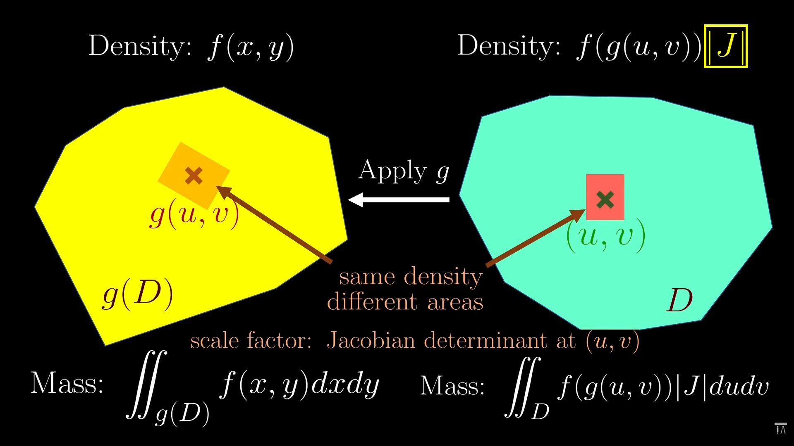
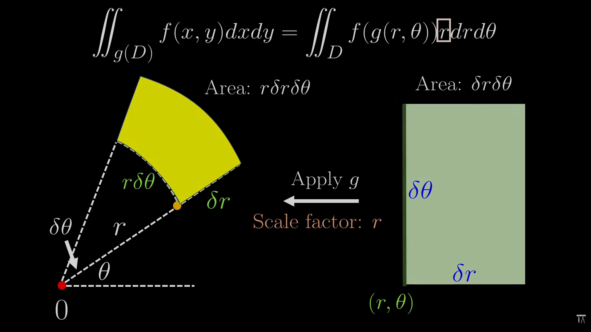

## What is Jacobian 

In 2D dimenions we say linear map when it follows three points - 
1. Parallel lines stay parallel after transformation of linear map.  - After transformation line should be parallel.
2. Even spacing must even after transformation. 
3. But the map must be fixed throughout all of the transformation.

### Determinant
In 2D map, it defines the scaling facotr of area between before and after transformation. 

### Derivates in 1D
Derivates in 1D tells the local scaling facotr, means if you derivate the function and zoom in at the particular point then you find that by how much its neighbouring points get strecthed or shrinked. We dont all of the points with respect to that point because the function stretches and shrinkes that whole line in different different way. We have to go infinitely close to see this effect.  
Even for the same function, the Jacobian and the derivative can be different depending on *a* means Agar hum kisi function ko ek specific point par zoom in karke dekhte hain, toh wahan scaling factor (derivative) kuch aur ho sakta hai (jaise video ke example mein ek point par yeh factor 3 tha).  Lekin agar hum usi same function mein apna point 'a' kisi doosri jagah shift kar dein, toh function ka behavior wahan bilkul alag ho sakta hai. Ho sakta hai nayi jagah par function points ko palat raha ho (reflection) aur 2 guna stretch kar raha ho, jiske karan us naye point par derivative -2 ho jayega.  

### Derivates in 2D
In 2D functions we have 2 inputs and 2 outputs. When we transform the function means than all of the straight lines got curved or distorted. Now after transformation, we have to focus on one point (a,b). When we focus or zoomr on that particular point then that distorted lines becomes straight and seems like linear map. Usually that small part is not straght line but it is seems like perfectly straight line. For further calculation we chose best or approximate straight line map.  
Usi "best match" waale linear map ki jaankaari dene k liye jo 4 numbers ka matrix bnta hai usko hum Jacobian matrix kehte hai.  
Now to get this matrix we need split the original function *f* into 2 parts - *f1* tells the x-cordinate of output. f2 tells the y-cordinate of output.   
Now we need to see, how these matrix form -  
**first column** -  
Horizontal Movement ka asar - Pehla column yeh batata hai ki agar hum point (a,b) se sirf horizontal direction (right side) mein thoda sa aage badhein, toh kya hoga.  
Isko nikalne ke liye hum ek temporary 1D function g sochte hain. Function g mein hum y-input ko fix kar dete hain aur sirf x-axis ke along move karte hain. Function g ka derivative, g′(a), humein batata hai ki horizontal movement karne par naya x-coordinate kitna scale hua. Ye humare matrix ka pehle column ka upar wala number hota hai.  
Usi tarah, ek aur function h sochte hain jo isi horizontal movement ka asar y-coordinate par batata hai. h′ (a) humare pehle column ka neeche wala number ban jata hai. To basically ye x point ka horizontal shift btate hai.
**Second Column**  
Doosra column yeh batata hai ki agar hum point (a,b) se sirf vertical direction (upar) mein aage badhein, toh kya hoga. Iske liye hum x-input ko fix kar dete hain aur do naye function p aur q sochte hain jo vertical line par focus karte hain.   
Function p ka derivative, p′(b), nikalta hai jo batata hai ki naya x-coordinate kahan gaya. unction q ka derivative, q'(b) , batata hai ki naya y-coordinate kahan gaya. Ye dono numbers doosre column mein aate hain.
*(Note: Maths mein in temporary functions ke derivatives nikalne ke is process ko Partial Derivatives kaha jata hai)*  
**Jab humara ye 4 numbers ka Jacobian matrix ban kar taiyaar ho jata hai, toh hum uska Determinant calculate kar sakte hain. Ye Jacobian determinant humein ek final number deta hai jo batata hai ki: Point (a,b) ke bilkul aas-paas ke chote se ilake ka Area kis factor se scale hua hai (badha ya ghata hai)**  
 Humara main goal sirf ye dekhna nahi hota ki point (a,b) kahan gaya, balki hum ye janna chahte hain ki us point ke bilkul aas-paas ka ilaka (neighbouring points) f function apply hone ke baad kis tarah transform hua ya bada/ghata.  

 ### Integral
 Previously we have seen the integral as the tool to calculate the area of the area.  We can also see this tool to calculate the mass of whole body or rod.  
** 1D Integration (Ek Bhaari Rod ka Mass Nikalna) - Maan lijiye aapke paas ek rod hai jiski density har jagah alag-alag hai, jise hum function f(x) se darshate hain. Iska total mass nikalne ke liye hum ye steps follow karte hain:   **
1. Hum rod ko bahut chhote-chhote tukdon mein baant dete hain. 
2.  Kyunki har ek tukda bahut chhota hai, hum maan lete hain ki us ek tukde ke andar density ek-samaan (uniform) hai, jaise f(x∗). 
3. mass of that small piece = f(x*) * dx (lenght of the small piece).
4.   Jab hum in saare chhote tukdon ke masses ko aapas mein jodte hain, toh wahi process mathematical roop mein Integral ∫f(x)dx ban jaati hai. Tukde jitne chhote honge, humara answer utna hi accurate hoga. 

**2D Integration (Ek Flat 2D Region ka Mass Nikalna)**  
Ab sochiye ki ek 1D rod ki jagah aapke paas ek flat 2D shape hai, jiski density alag-alag jagah par f(x,y) hai.  
Hum is poore 2D region ko ek grid ki tarah chhote-chhote rectangles (chaukhor) mein baant dete hain. (Jo hisse edges par rectangle nahi ban paate, unhe hum ignore kar dete hain kyunki chhote hone ke karan unka asar na ke barabar hota hai).  
  
Har chhote rectangle ka mass uski density aur uske area (dx⋅dy) ko multiply karke nikalta hai.  In saare rectangles ke mass ko jodna hi 2D integral ya ∬f(x,y)dxdy kahlata hai.  
Aap ek saath saare rectangles nahi jod sakte, isliye isko ek systematic tarike se kiya jata hai.  
Sabse pehle hum ek vertical strip banate hain. Yeh strip ek 1D rod jaisi hi hoti hai, bas iski ek patli si width  hoti hai.  
Hum is patti ka mass ek 1D integral ka use karke nikalte hain, jahan f(x,y)dy un chhote rectangles ke mass per unit width ko darshata hai.  
Har vertical patti ki lambaai alag ho sakti hai, isliye integral ke limits (endpoints) is baat par depend karte hain ki patti x-axis par kahan rakhi hai.  
Jab humein ek patti ke mass ka equation mil jata hai (let say g(x)) toh hum aisi saari vertical pattiyon ko horizontal axis (x-axis) ke along left se right tak integrate karke jod dete hain. (Hum chahein toh iska ulta karke pehle horizontal strips bhi le sakte hain).  
In easy words - mass per unit widht means Agar is vertical patti ki chaudai (width) exactly 1 unit hoti, toh is poori patti ka wazan (mass) kitna hota.  
$ \text{Mass of the strip} = (\text{Mass per unit width}) \times (\text{Width}) $  
Yaani:  
$ \text{Mass} = g(x)\,dx $  

**Changing variables in Integration (1D)**
Lets consider we have a rod, and we are calculating mass but its end is the function of another function like g(a) and g(b).

  

Because its a bit difficult to integrate with the function type endpoints. To hum kya krenge ki nayi rod bnate hai. Aur mapping function rkhte hai let say g(Z). To mtlb agr hum *u* point choose krte hai nayi rod mein aur humko dekhna ho ki ye *u* point kahan resemble hoga purani rod mein to hum g(z) mein value put krke dekh skte hai i.e. g(u). Aur purani rod ki density function f(x) hai to isme value put krke hum density bhi nikaal skte hai i.e f(g(u)). But yes hmne desnity same krdee par map hone ki wjh se jo point hum consider kr rhe hai let say *u* is point (means tukda here) ki lenght dono rod mein alg alg hogi. Agar lambaai alag hogi, toh unka mass (wazan) bhi alag aayega, jabki humein mass ekdum barabar karna hai. 
Nayi rod se purani rod tak jane mein us chhote tukde ki lambaai kis factor se scale hui (kheenchi ya sikudi)? Yeh scaling factor us mapping function g(z) ka derivative bn jaata hai g'(z).  
Dono tukdon ka mass ekdum barabar karne ke liye, humein is lambaai ke farak ko theek karna padta hai. Isliye, hum nayi rod ki density mein is scaling factor g'(z) ko multiply kar dete hai.  Isi wajah se, jab hum nayi rod ka total mass nikalte hain, toh equation (integral) kuch aisi dikhti hai:  
$
∫f(g(u))⋅g′(u)du
$

And this is we called integration by subsitution, but how does it work in 2D.  
  

We have a 2-D region and we have to calculate its mass (M). The region is g(D). To make it simple we create another simple region which is region D. If we take one point (u,v) from region D and so with the help of mapping function we can map that point to the older region and it'd seen like *g(u,v)*. 1D ki hi tarah, hum purane region ki density f(g(u,v)) ko naye region ke point par "copy" kar dete hain.  
Ab humare paas dono jagah ek-ek chhota sa hissa (rectangle) hai jinki density same hai. Lekin map hone ki wajah se, un dono chhote hisson ka Area alag-alag hota hai.  
Is Area ke farak ko theek karne ke liye humein ek scaling factor chahiye hota hai. Aur jaisa humne pehle padha tha, 2D mein kisi point ke bilkul aas-paas Area ka scaling factor uska Jacobian Determinant (J) hota hai.  
Area ke farak ko theek karne ke liye hum density mein Jacobian Determinant multiply karte hain. Lekin kya hoga agar ye determinant negative aa jaye? Negative determinant ka matlab bas itna hota hai ki map hote waqt shape palat (reflect) gayi hai.  
  
Lekin kisi bhi cheez ka Area kabhi negative nahi ho sakta, wo negative sign ki parwah nahi karta. Isliye 2D substitution mein, humein hamesha Jacobian determinant ki Absolute Value (yaani positive value, ∣J∣) lagani padti hai.  
Par 1D mein humne absolute value kyun nhi lgai thi kyunki  
1. Because in 1-D integral ki direction (orientation) pehle se fix hoti hai (jaise limits a se b tak). Agar scaling factor negative hota hai aur rod palat jati hai, toh integral limits bhi palat jati hain, jisse answer apne aap theek ho jata hai.
2. 2D integrals sirf ek "region" par hote hain, unme aisi koi direction ya orientation nahi hoti. Isliye wahan negative aane par formula khud theek nahi ho sakta, aur humein jaan-boojh kar absolute value (∣J∣) lagana padta h.  

Agr hmara function *injective* nahi hoga to us se kya hoega ki function overlap kr deta hai mapping krte wqt asaan bhasha mein agar aapka mapping function *g* ajeeb tarike se kaam karta hai aur original shape ke do alag-alag hisson ko ek hi jagah par bhej deta hai, toh wahan shape apne upar hi fold (overlap) ho jati hai. Wahan ek ke upar ek, do layers ban jati hain.  2D integration mein hum area ke scaling factor ko hamesha positive rakhne ke liye Jacobian determinant ki Absolute Value lagate hain, kyunki 2D integral mein koi fixed direction ya orientation nahi hoti. Jab 2D integral is fold hui jagah par calculate karna shuru karta hai, toh use wahan do layers milti hain. Agar humne absolute value nahi lagai hoti, toh shayad fold hone ki wajah se ek layer ka Jacobian negative aata aur wo cancel ho jata (jaise 1D integrals mein hota hai kyunki wahan orientation built-in hoti hai).  
Lekin 2D mein absolute value ki wajah se integral us fold hone wali (negative) direction ko ignore kar deta hai. Wo dono layers ke area ko positive maan leta hai aur unhe aapas mein add kar deta hai. Nateeja ye hota hai ki us overlap (fold) wale hisse ka mass aur area do baar (integrated twice) count ho jata hai. 
Isi double counting ki galti ko rokne ke liye, hum ek strict rule banate hain ki mapping function g aisa nahi hona chahiye jo shape ko fold kare; mathematical terms mein, use "injective" (one-one mapping) function hona chahiye.

## Cartesian to Polar
Jab bhi math mein circle jaisi koi shape aati hai, toh Cartesian (x,y) integrals mein aane wale ajeeb square roots se bachne ke liye polar coordinates (r,θ) ka use karna sabse aasan aur sahi tarika hota hai.  
Agar aap kisi circle (jaise ek unit disc) ka area ya mass normal Cartesian coordinates (x,y) se nikalte hain, toh integration ke endpoints (limits) mein square roots aate hain jinko solve karna bohot ajeeb aur mushkil hota hai. Ise aasan banane ke liye hum variables change karke Polar coordinates (r,θ) ka use karte hain. Polar world mein, ye region bas ek simple rectangle ki tarah hota hai jahan radius r (0 se 1) aur angle θ (0 se 2π) ke beech move karta hai.  
Formula ke hisaab se humein Jacobian determinant chahiye (yani area ka scaling factor nikalna hai).  
Maan lijiye polar world mein aapke paas ek bohot chhota sa rectangle hai jiski ek side Δr aur dusri side Δθ hai.  Iska area Δr⋅Δθ hoga.  
  
Jab aapka mapping function is chhote rectangle ko wapas purane Cartesian world (circle) mein bhejta hai, toh iski shape thodi badal jati hai. 
Jo side Δr thi, wo circle mein ek seedhi line (radius ka hissa) hi rehti hai, toh uski lambaai Δr hi bachti hai. Lekin jo side Δθ thi, wo circle ke andar ek ghoomti hui arc (curve) ban jati hai. Math mein arc ki lambaai nikalne ka formula hota hai Radius × Angle. Toh is arc ki nayi lambai r⋅Δθ ban jati hai.  
Toh us naye hisse ka total area lagbhag kitna hua?  
 $\Delta r \times (r \cdot \Delta \theta) = r \cdot \Delta r \cdot \Delta \theta$  
Ab khud sochiye, purana area tha Δr⋅Δθ aur naya map hua area aaya r⋅Δr⋅Δθ. Iska matlab naya area kis factor se scale hua (badha)? 'r' factor se! Isliye, Polar coordinates ke liye Jacobian determinant ka result 'r' nikal kar aata hai.  
Aur yahi wajah hai ki jab hum Cartesian se Polar mein equations ko change karte hain, toh integration ke formula mein ek extra 'r' lagana padta hai

### Robotics - Manipulator
Jaise humne pda -  pure math mein Jacobian matrix ($J$) hume batata hai ki ek space se dusre space mein jaane par $x, y, z$ mein kitna deviation ya change aayega.  
Robotics ke terms mein, agar tum apne robot ke joints ko ek bohot hi chote angle $d\vec{q}$ (infinitesimal deviation) se ghumaoge, to end-effector ki position mein jo chota sa deviation $d\vec{x}$ ($dx, dy, dz$) aayega, usko Jacobian aise map karega: 
$$d\vec{x} = J(\vec{q}) \cdot d\vec{q}$$
Yahan wahi scaling ho rahi hai jo humne discuss kiya tha:
$d\vec{q}$ joint space ka ek chota sa "area/volume" ya vector deviation hai.  
$J(\vec{q})$ usko scale aur rotate karke Task Space (Cartesian space) ka deviation $d\vec{x}$ bana deta hai.  
Ab imagine karo ki ye saare chote-chote deviations ek moving robot mein continuous ho rahe hain. Agar ye saare badlav ek chote se time interval $dt$ ke andar ho rahe hain, to hum dono sides ko $dt$ se divide kar sakte hain: 
$$\frac{d\vec{x}}{dt} = J(\vec{q}) \cdot \frac{d\vec{q}}{dt}$$
Calculus ki definition se:  
$\frac{d\vec{q}}{dt}$ - kya hai? Joint angles ka time ke sath badalna, yaani Joint Velocity ($\dot{\vec{q}}$).  
$\frac{d\vec{x}}{dt}$ kya hai? End-effector ki position ka time ke sath badalna, yaani Linear/Angular Velocity ($\vec{v}$).  
Is tarah equation ban jati hai: $\vec{v} = J\dot{\vec{q}}$
Iska matlab ye hua ki Velocity actually aur kuch nahi, balki instantaneous deviation hi hai per unit time.  
Agar hum matrix ke andar jhaank kar dekhein, to tumhara $x, y, z$ deviation wala logic bilkul saaf dikhega. Maan lo ek 3-joint robot hai, to $J$ matrix aisi dikhegi:  
$$J = \begin{bmatrix}\frac{\partial x}{\partial q_1} & \frac{\partial x}{\partial q_2} & \frac{\partial x}{\partial q_3} \\
\frac{\partial y}{\partial q_1} & \frac{\partial y}{\partial q_2} & \frac{\partial y}{\partial q_3} \\
\frac{\partial z}{\partial q_1} & \frac{\partial z}{\partial q_2} & \frac{\partial z}{\partial q_3}\end{bmatrix}$$
Pehla Column: Batata hai ki agar sirf Joint 1 move kare, to $x, y, z$ mein kitna deviation rate aayega.
Dusra Column: Batata hai ki agar sirf Joint 2 move kare, to $x, y, z$ mein kitna deviation rate aayega.  
Jab hum is matrix ko joint velocities vector $\begin{bmatrix} \dot{q}_1 & \dot{q}_2 & \dot{q}_3 \end{bmatrix}^T$ se multiply karte hain, to hum basically har joint ke individual contribution (scaling) ko aapas mein linear combination (superposition) ke throug jod rahe hote hain.  
Mtlb kese ek particular joint ka rate of change with respect to time kese map ho rha hai ek naye cartesian space mein wo btati ye equation.
$$\frac{d\vec{x}}{dt} = J(\vec{q}) \cdot \frac{d\vec{q}}{dt}$$

