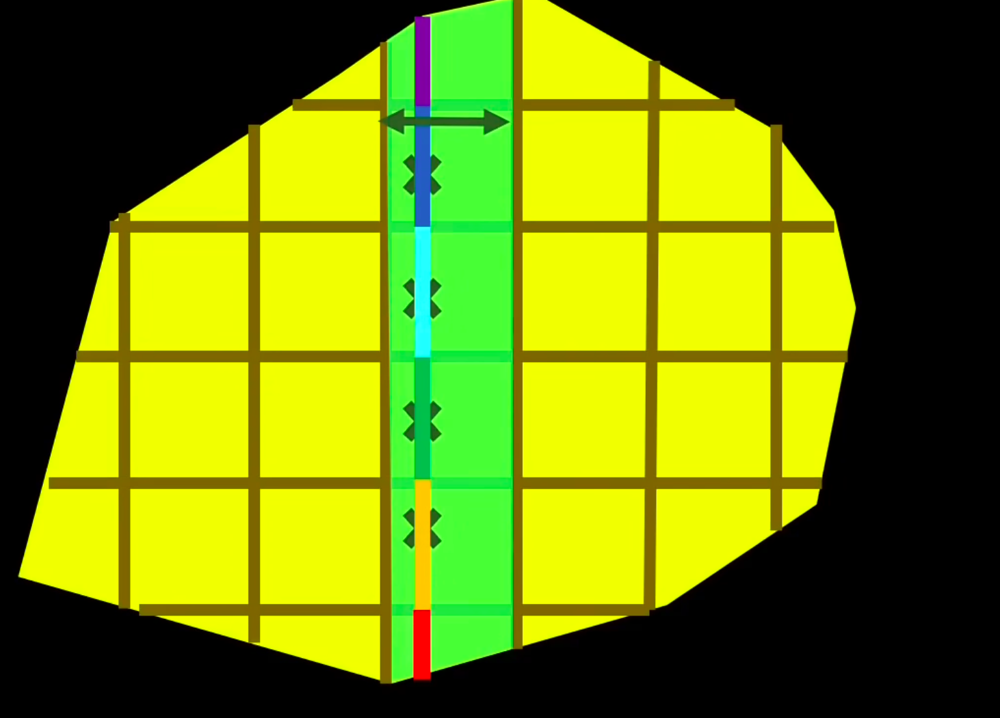

## What is Jacobian 

In 2D dimenions we say linear map when it follows three points - 
1. Parallel lines stay parallel after transformation of linear map.  - After transformation line should be parallel.
2. Even spacing must even after transformation. 
3. But the map must be fixed throughout all of the transformation.

### Determinant
In 2D map, it defines the scaling facotr of area between before and after transformation. 

### Derivates in 1D
Derivates in 1D tells the local scaling facotr, means if you derivate the function and zoom in at the particular point then you find that by how much its neighbouring points get strecthed or shrinked. We dont all of the points with respect to that point because the function stretches and shrinkes that whole line in different different way. We have to go infinitely close to see this effect.  
Even for the same function, the Jacobian and the derivative can be different depending on *a* means Agar hum kisi function ko ek specific point par zoom in karke dekhte hain, toh wahan scaling factor (derivative) kuch aur ho sakta hai (jaise video ke example mein ek point par yeh factor 3 tha).  Lekin agar hum usi same function mein apna point 'a' kisi doosri jagah shift kar dein, toh function ka behavior wahan bilkul alag ho sakta hai. Ho sakta hai nayi jagah par function points ko palat raha ho (reflection) aur 2 guna stretch kar raha ho, jiske karan us naye point par derivative -2 ho jayega.  

### Derivates in 2D
In 2D functions we have 2 inputs and 2 outputs. When we transform the function means than all of the straight lines got curved or distorted. Now after transformation, we have to focus on one point (a,b). When we focus or zoomr on that particular point then that distorted lines becomes straight and seems like linear map. Usually that small part is not straght line but it is seems like perfectly straight line. For further calculation we chose best or approximate straight line map.  
Usi "best match" waale linear map ki jaankaari dene k liye jo 4 numbers ka matrix bnta hai usko hum Jacobian matrix kehte hai.  
Now to get this matrix we need split the original function *f* into 2 parts - *f1* tells the x-cordinate of output. f2 tells the y-cordinate of output.   
Now we need to see, how these matrix form -  
**first column** -  
Horizontal Movement ka asar - Pehla column yeh batata hai ki agar hum point (a,b) se sirf horizontal direction (right side) mein thoda sa aage badhein, toh kya hoga.  
Isko nikalne ke liye hum ek temporary 1D function g sochte hain. Function g mein hum y-input ko fix kar dete hain aur sirf x-axis ke along move karte hain. Function g ka derivative, g′(a), humein batata hai ki horizontal movement karne par naya x-coordinate kitna scale hua. Ye humare matrix ka pehle column ka upar wala number hota hai.  
Usi tarah, ek aur function h sochte hain jo isi horizontal movement ka asar y-coordinate par batata hai. h′ (a) humare pehle column ka neeche wala number ban jata hai. To basically ye x point ka horizontal shift btate hai.
**Second Column**  
Doosra column yeh batata hai ki agar hum point (a,b) se sirf vertical direction (upar) mein aage badhein, toh kya hoga. Iske liye hum x-input ko fix kar dete hain aur do naye function p aur q sochte hain jo vertical line par focus karte hain.   
Function p ka derivative, p′(b), nikalta hai jo batata hai ki naya x-coordinate kahan gaya. unction q ka derivative, q'(b) , batata hai ki naya y-coordinate kahan gaya. Ye dono numbers doosre column mein aate hain.
*(Note: Maths mein in temporary functions ke derivatives nikalne ke is process ko Partial Derivatives kaha jata hai)*  
**Jab humara ye 4 numbers ka Jacobian matrix ban kar taiyaar ho jata hai, toh hum uska Determinant calculate kar sakte hain. Ye Jacobian determinant humein ek final number deta hai jo batata hai ki: Point (a,b) ke bilkul aas-paas ke chote se ilake ka Area kis factor se scale hua hai (badha ya ghata hai)**  
 Humara main goal sirf ye dekhna nahi hota ki point (a,b) kahan gaya, balki hum ye janna chahte hain ki us point ke bilkul aas-paas ka ilaka (neighbouring points) f function apply hone ke baad kis tarah transform hua ya bada/ghata.  

 ### Integral
 Previously we have seen the integral as the tool to calculate the area of the area.  We can also see this tool to calculate the mass of whole body or rod.  
** 1D Integration (Ek Bhaari Rod ka Mass Nikalna) - Maan lijiye aapke paas ek rod hai jiski density har jagah alag-alag hai, jise hum function f(x) se darshate hain. Iska total mass nikalne ke liye hum ye steps follow karte hain:   **
1. Hum rod ko bahut chhote-chhote tukdon mein baant dete hain. 
2.  Kyunki har ek tukda bahut chhota hai, hum maan lete hain ki us ek tukde ke andar density ek-samaan (uniform) hai, jaise f(x∗). 
3. mass of that small piece = f(x*) * dx (lenght of the small piece).
4.   Jab hum in saare chhote tukdon ke masses ko aapas mein jodte hain, toh wahi process mathematical roop mein Integral ∫f(x)dx ban jaati hai. Tukde jitne chhote honge, humara answer utna hi accurate hoga. 

**2D Integration (Ek Flat 2D Region ka Mass Nikalna)**  
Ab sochiye ki ek 1D rod ki jagah aapke paas ek flat 2D shape hai, jiski density alag-alag jagah par f(x,y) hai.  
Hum is poore 2D region ko ek grid ki tarah chhote-chhote rectangles (chaukhor) mein baant dete hain. (Jo hisse edges par rectangle nahi ban paate, unhe hum ignore kar dete hain kyunki chhote hone ke karan unka asar na ke barabar hota hai).  
  
Har chhote rectangle ka mass uski density aur uske area (dx⋅dy) ko multiply karke nikalta hai.  In saare rectangles ke mass ko jodna hi 2D integral ya ∬f(x,y)dxdy kahlata hai.  
Aap ek saath saare rectangles nahi jod sakte, isliye isko ek systematic tarike se kiya jata hai.  
Sabse pehle hum ek vertical strip banate hain. Yeh strip ek 1D rod jaisi hi hoti hai, bas iski ek patli si width  hoti hai.  
Hum is patti ka mass ek 1D integral ka use karke nikalte hain, jahan f(x,y)dy un chhote rectangles ke mass per unit width ko darshata hai.  
Har vertical patti ki lambaai alag ho sakti hai, isliye integral ke limits (endpoints) is baat par depend karte hain ki patti x-axis par kahan rakhi hai.  
Jab humein ek patti ke mass ka equation mil jata hai (let say g(x)) toh hum aisi saari vertical pattiyon ko horizontal axis (x-axis) ke along left se right tak integrate karke jod dete hain. (Hum chahein toh iska ulta karke pehle horizontal strips bhi le sakte hain).  
In easy words - mass per unit widht means Agar is vertical patti ki chaudai (width) exactly 1 unit hoti, toh is poori patti ka wazan (mass) kitna hota.  
$ \text{Mass of the strip} = (\text{Mass per unit width}) \times (\text{Width}) $  
Yaani:  
$ \text{Mass} = g(x)\,dx $  

