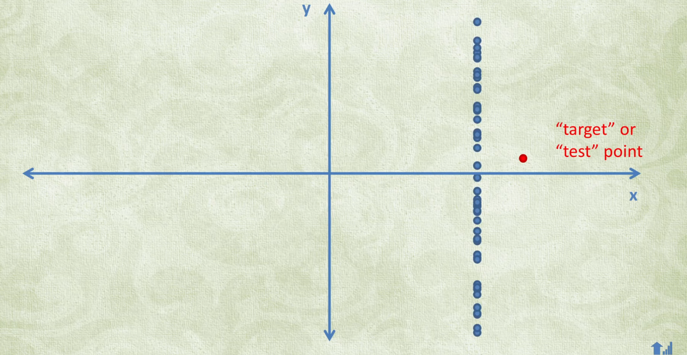
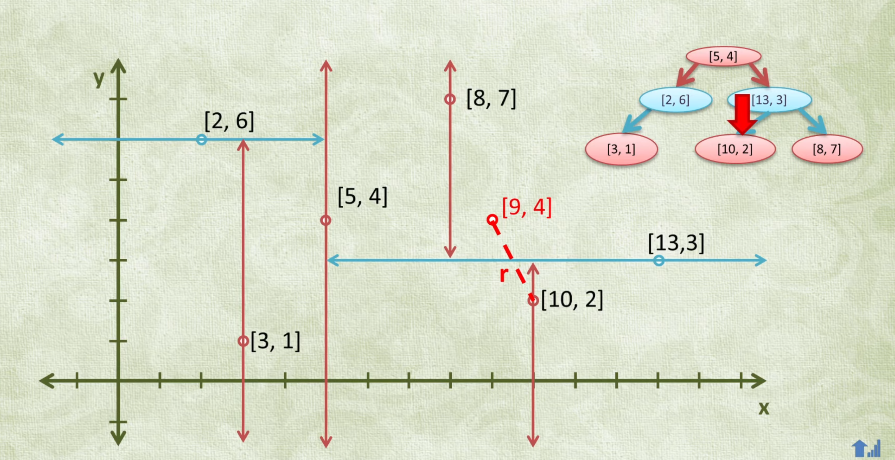

## KD-Tree data structure
Yeh data structure tab bahut kaam aata hai jab humein data ko ek se zyada criteria (properties) ke hisaab se organize karna hota hai. Isko samjhane ke liye ek 2D plane ka example diya gaya hai jahan humein kisi target point ka "nearest neighbor" (sabse kareebi point) dhoondhna hai.  

  
Agar hum in points ko ek array mein rakh kar sirf X-coordinate ke hisaab se sort karein aur binary search lagayen, toh iska matlab yeh nahi hai ki humein closest Y-coordinate wala point bhi mil jayega. Agar saare points ka X-coordinate bilkul same ho, toh humein majbooran ek-ek karke saare points ko check karna padega jo ki time-consuming hai.  
  
KD-Tree bilkul ek regular Binary Search Tree (BST) ki tarah hi hota hai, par isme har node mein ek ke bajaye 'k' values store hoti hain. 'k' ka matlab hai data points ki total properties ki ginti (jaise 2D plane mein 2 properties hoti hain: X coordinate aur Y coordinate).  
Jab hum tree mein naye nodes daalte hain ya usko traverse karte hain, toh hum depth ke hisaab se check kiye jane wale coordinates ko badalte (alternate karte) rehte hain. Jaise agar root node par X-coordinate ke hisaab se comparison ho raha hai, toh uske child (second level) par Y-coordinate check hoga, aur grandchildren nodes par wapas X-coordinate check hoga, aur isi tarah aage chalta rahega.  
  

Maan lijiye humara target point (9, 4) hai aur humein iska sabse kareebi point dhoondhna hai. Hum tree mein root se shuru karke conditions check karte hue neeche aate hain. Lekin neeche aate waqt, ho sakta hai hum koi bahut kareebi point (jaise 10, 2) miss kar dein, kyunki Y-coordinate ke comparison ki wajah se humne right branch chuni thi aur wo point left mein reh gaya.  

Jab hum tree mein sabse neeche pahunch jate hain aur ek 'candidate' (ab tak ka sabse kareebi point) dhoondh lete hain, toh hum recursion se wapas upar aana shuru karte hain. Hum apne target aur candidate point ke beech ke distance ko ek line maan lete hain, jise r kehte hain. Phir hum check karte hain ki jis branch (section) ko humne pehle chhod diya tha, us branch ka seedha (perpendicular) distance hamare target se kitna hai. Ise r prime kehte hain. Agar r prime hamare r se chota nikalta hai, toh iska matlab hai ki us chhute hue hisse mein koi aur zyada kareebi point ho sakta hai. Isliye hum us branch ke andar jaakar bhi search karte hain.  
 Upar wale step ko sunkar lag sakta hai ki humein saare nodes check karne padenge, par aisa nahi hai. Agar tree ki height h hai, toh hum zyada se zyada sirf 2h nodes hi visit karenge. Iska matlab yeh ek logarithmic search hai aur bahut fast kaam karti h.  
   

Example explanation -  
Sabse pehle hum root node par hote hain, jahan arbitrary tarike se pehla property chuna jata hai (maan lo X-coordinate). Hum target point (9, 4) ke X-coordinate (jo ki 9 hai) ko root node ke X-coordinate se compare karte hain. Rule simple hai: agar target chota hai toh Left jaate hain, bada hai toh Right jaate hain.  
Rule simple hai: agar target chota hai toh Left jaate hain, bada hai toh Right jaate hain. Yahan KD-Tree ka rule badalta hai aur ab humein Y-coordinate compare karna hota hai.   
1. Hamare target (9, 4) ka Y-coordinate 4 hai.
2. Is node (13, 3) ka Y-coordinate 3 hai.
3. Kyunki hamara target bada hai (4 > 3), toh hum uski Right branch mein chale jaate hain.  

Sirf ek (Y) coordinate check karke humne Right branch chuni, isliye Left branch puri tarah se discard (ignore) ho gayi. Yahi wajah thi ki left branch mein chhupa hua ek bahut kareebi point (10, 2) humse starting mein miss ho gaya tha.  
Aise hi X aur Y ko alternate karte hue (jaise agle level par wapas X, fir Y) hum tree mein bilkul neeche tak (leaf node tak) jaate hain. Wahan jo sabse aakhri/best point milta hai, use hum apna "candidate closest neighbor" maan lete hain. Phir hum apne target (9, 4) aur is candidate point ke beech ka direct distance (diagonal line) nikaalte hain, jise hum r kehte hain.  

Ab yahan se backtracking (recursion unwind) shuru hoti hai, jo is tree ka asli "magic" hai. 
1. Hum neeche se wapas upar aana shuru karte hain.
2. Jab hum wapas us node (13, 3) par aate hain, toh humein yaad aata hai ki humne iska ek pura section (Left branch) discard kar diya tha.
3. Ab hum apne target point se us discard kiye gaye section ki boundary tak ka ek direct (perpendicular) distance calculate karte hain. Is distance ko r prime (ya r') kaha jata hai.  

Yahan par check hota hai ki kya us chhodi hui branch mein wapas jaana chahiye ya nahi:
1. Agar r' chota hai r se: Iska matlab hai ki us discard kiye gaye section ki boundary hamare current best candidate se zyada paas hai. Isliye, yeh "chance" banta hai ki us boundary ke andar koi aur bhi paas wala point ho (jaise hamara chhuta hua (10, 2)). oh hum backtracking karte hue us section ke andar traverse karte hain. 

2. Agar r' bada hota: Toh iska matlab boundary hi door hai, toh andar ka point kareeb ho hi nahi sakta. Aise mein hum us branch ko puri tarah ignore karke aage badh jaate hai.  

Ek important notice,  
Hum bilkul upar Root Node tak wapas jayenge. Hum sirf leaf node ke parent tak simit nahi rahenge.  
Search ka process "recursion" use karta hai, jiska matlab hi yeh hai ki jis raaste se aap root se neeche aaye the, aapko us poore raaste se ek-ek karke wapas upar (unwind karte hue) root tak jana hi hoga. Jab aap wapas upar jaate hain (backtrack karte hain), toh yeh r aur r' ka comparison sirf kisi ek jagah nahi hota, balki har us node par hota hai jahan se aapne koi branch chhodi thi.  
1. Pehle aap leaf node ke parent par check karenge.
2. Phir aap uske upar wale node (jaise 13,3) par aayenge aur wahan ki chhuti hui branch ka r' check karenge.
3. Iske baad aap (13,3) ke bhi upar wale parent (yaani Root node tak) jayenge, aur root par jo branch aapne sabse shuru mein chhod di thi, uska bhi r' check karenge.  
Jab aap backtrack karke kisi bhi upar wale node par aate hain, toh rule wahi same lagega jo aapne kaha:
1. Agar us level ki chhodi hui branch ka r' (perpendicular distance) aapke current best r se chota hai, toh aap us branch mein zaroor ghusenge.
2. Agar nahi hai, toh aap us branch ko skip karke bas recursion mein aur upar chale jayenge.
