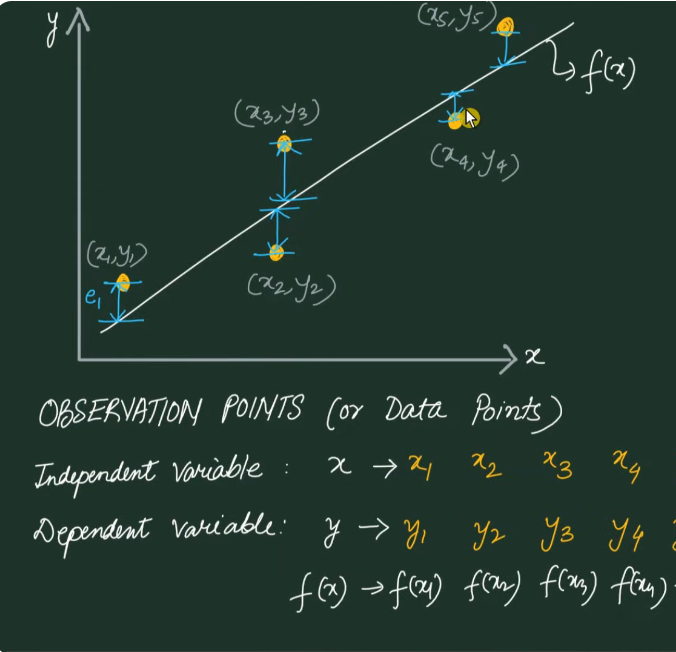

# Least square method
This source gives you an insight on the least square method, a mathematical technique used to find the line of best fit for experimental data that contains errors or set of random points.  
Let say we have 'n' number of observations for our dataset. And we have to find the best fitter line which rerpresents those scattered data.  
Let say the function which represents the best fit model is $f(X)$. So  
## Individual Error
  
Kisi bhi general point $( X_i )$ par actual observation point $( Y_i )$ aur best fit line ke point $( f(X_i))$ ke beech ka difference **individual error** kehlata hai.

Iska equation hai:

$$
e_i = Y_i - f(X_i)
$$

Kyunki individual errors positive ya negative dono ho sakte hain, unhe direct jodne par wo ek dusre ko cancel kar sakte hain. Isliye, total error nikalne ke liye sabhi errors ka square karke unka summation (sum) kiya jata hai.  

Iska equation hai:

$$
E = \sum_{i=1}^{n} \left( Y_i - f(X_i) \right)^2
$$
Agar best fit line ek straight line maani jaye jiska function \( f(X) = aX + B \) hai (jahan \( a \) slope hai aur \( B \) intercept hai), toh total squared error ki equation aisi dikhti hai:

$$
E = \sum_{i=1}^{n} \left( Y_i - (aX_i + B) \right)^2
$$

*P.S - Tum ye function kuch bhi maan skte*.  

## Minimize the sum of the square of errors.
Now our objective is to minimise this *E*.  
If we see this *E* equation, then we have to know that the only unknown we have is *a* and *b*.  
Kyunki humein error ko sabse kam (minimize) karna hai, isliye total error equation ko \( a \) aur \( b \) ke respect mein alag-alag differentiate (derivative) karke zero \( (0) \) ke barabar rakha jata hai.  

Iske formulas hain:

$$
\frac{\partial E}{\partial a} = 0
$$

$$
\frac{\partial E}{\partial b} = 0
$$
*E* ki value put krte hai upr diye gayi dono derivatives equation mein aur solve karne par humein do main linear equations milti hain:

### Pehli Equation  
(\( a \) ke respect mein derivative se)

$$
a \sum X_i^2 + b \sum X_i = \sum X_i Y_i
$$

### Doosri Equation  
(\( b \) ke respect mein derivative se)

$$
a \sum X_i + b \cdot n = \sum Y_i
$$

*Yahan \( n \) represents totoal number of observations*  

Now hum is equation ko matrix ki form mein likh skte hai. Like this  

$$
\left(
\begin{array}{cc}
\sum X_i^2 & \sum X_i \\
\sum X_i & n
\end{array}
\right)
\left(
\begin{array}{c}
a \\
b
\end{array}
\right)
=
\left(
\begin{array}{c}
\sum X_i Y_i \\
\sum Y_i
\end{array}
\right)
$$

Aur further inhe matrix format \( A \cdot X = B \) mein convert kiya ja sakta hai.

Inme matrices is tarah banti hain:

### Matrix \( A \)  
(Known values ya observation data points)

$$
A =
\begin{bmatrix}
\sum X_i^2 & \sum X_i \\
\sum X_i & n
\end{bmatrix}
$$

### Matrix \( X \)  
(Unknown values jo hmko nikalni hain)

$$
X =
\begin{bmatrix}
a \\
b
\end{bmatrix}
$$

### Matrix \( B \)  
(Known values)

$$
B =
\begin{bmatrix}
\sum X_i Y_i \\
\sum Y_i
\end{bmatrix}
$$

Matrix equation se $( a )$ aur $( b )$ ki final values nikalne ke liye matrix $( A )$ ka inverse $(A^{-1})$ nikal kar use matrix $( B )$ se multiply kar diya jata hai.  

Iska formula hai:

$$
X = A^{-1} B
$$