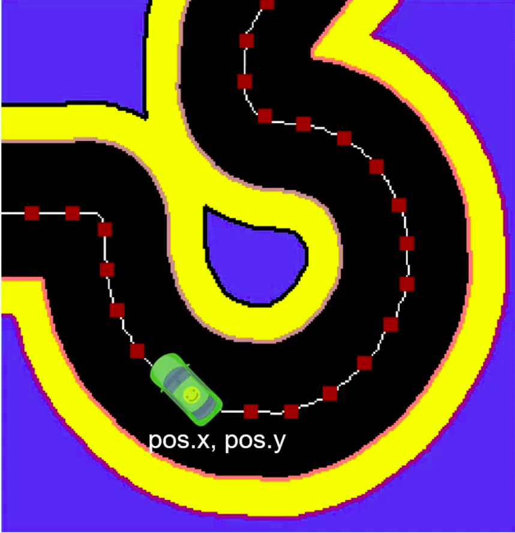
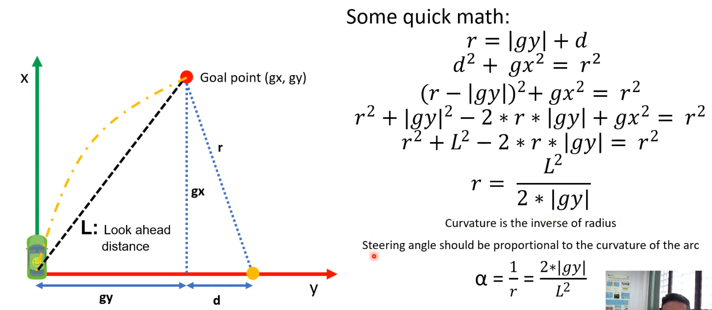
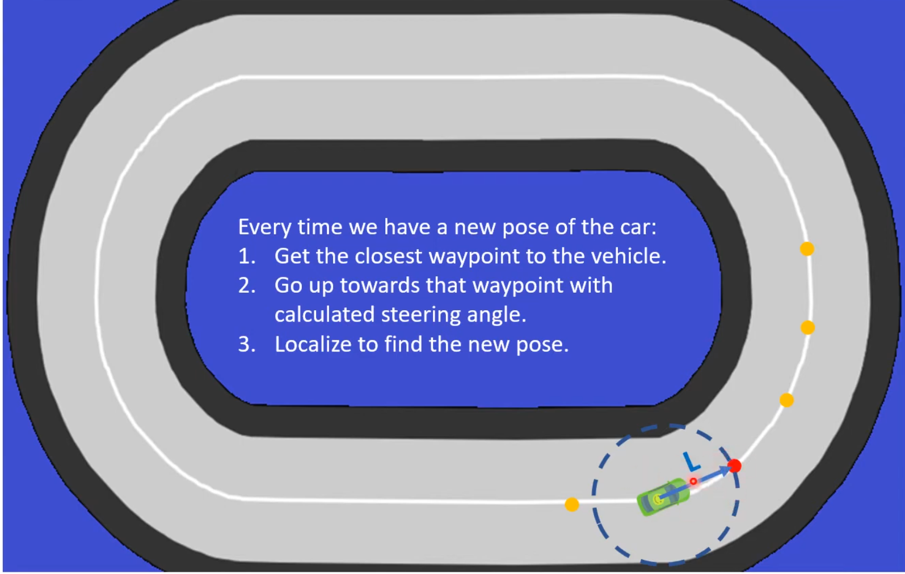
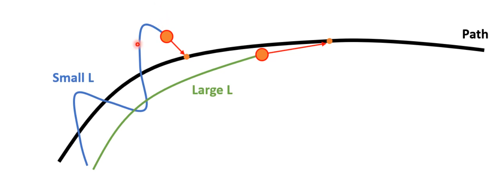

# Pure Pursuit Controller
### What is Pure Pursuit controller?
  
Yeh ek path-tracking algorithm hai jise 1992 mein Craig Coulter ne banaya tha. Yeh aaj bhi autonomous vehicles aur mobile robots (jaise Formula 10th competition mein chalne wali RC cars) ko raste ke beech mein chalne ke liye istemaal hota hai.  
Yeh kaam kaise karta hai? Is algorithm ke kaam karne ke kuch buniyadi asool (assumptions) hain:  
1. Rasta (path) 2D waypoints (points) ka ek sequence hota hai jo car ko follow karna hota hai.
2. Car ko in waypoints ka pata hota hai aur woh is system mein apni position (localize) khud tay kar sakti hai.
3. Car ka main maqsad in waypoints ko 'look-ahead direction' mein follow karna hota hai.

### Geometrical Calculation aur Steering Angle:
1. Car ka x-axis aage (forward) ki taraf aur y-axis right side par hota hai
2. Isme ek "look-ahead distance" tay kiya jata hai (jo algorithm ka ek parameter hai), jiski madad se ek aage ka goal waypoint chuna jata hai.
3. Car goal point tak seedha jaane ke bajaye ek arc (ghumaav) banati hai, jiska center hamesha car ke y-axis par fix hota hai taaki ek unique rasta ban sake.
4. Car goal point tak seedha jaane ke bajaye ek arc (ghumaav) banati hai, par arc bahut saari trike se bnti hai unique bnane k liye arc ka center hamesha car ke y-axis par fix hota hai taaki ek unique rasta ban sake.
5. Kuch simple math equations ka istemaal karke is arc ka radius (R) nikala jata hai. 

$$R = \frac{2y}{L^2}$$

$$\alpha = \frac{1}{R} = \frac{L^2}{2y}$$
where $\alpha$ is the curvature and $r$ is the radius of the arc.  

  

## How to follow the waypoinst?

  
Jaise hi car thoda aage badhti hai (new pose), woh dobara sabse kareeb ka waypoint dhoondhti hai jo look-ahead range mein ho, naya steering angle calculate karti hai, aur yeh process baar-baar repeat hota hai. 

## Tunning L Parameter

   
Look-ahead Distance ka asar:  
1. Chota distance (Smaller L): Car bohot tezi se aur aggressive turn leti hai. Isse car raste ke bohot kareeb reh kar chalne ki koshish karti hai, lekin isse gadi unstable ho sakti hai aur uski dynamics par bura asar padh sakta hai.
2. Bada distance (Larger L): Car ka rasta kaafi smooth ho jata hai, lekin isme "tracking errors" (raste se bhatakna) badh jate hain. Car corners (mod) ko cut kar sakti hai, jiski wajah se woh kisi rukawat (obstacle) ke bohot kareeb se guzar sakti hai.
 
