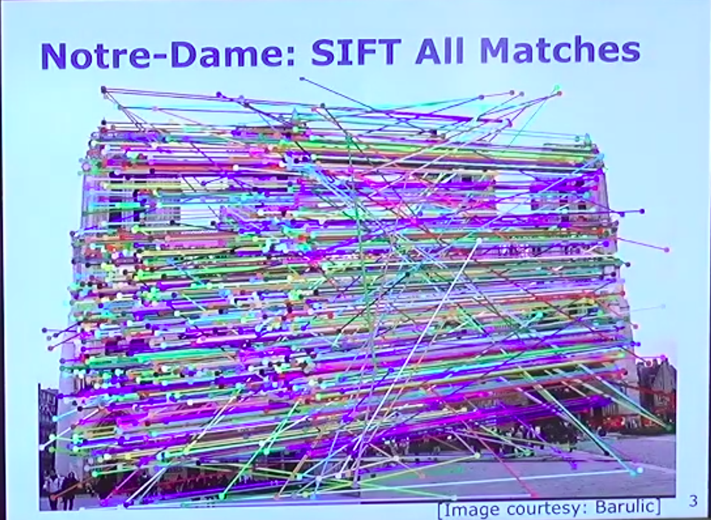
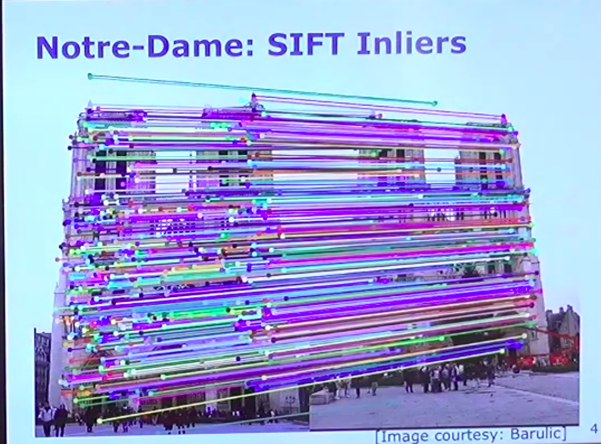
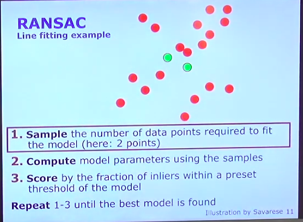
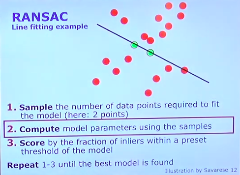
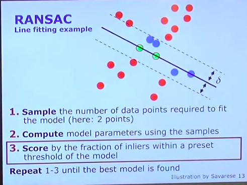
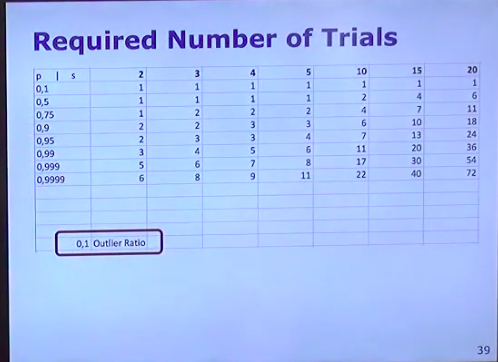
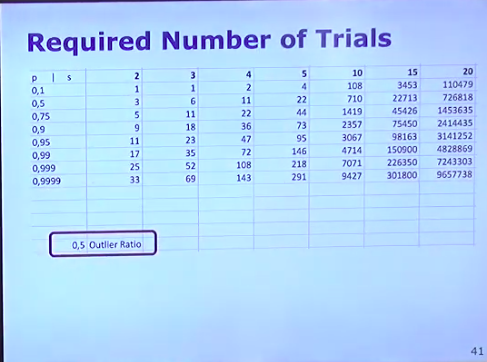

#  RANSAC (Random Sample Consensus)
## RANSAC in a nutshell.
Jab bhi hum real-world data capture karte hain, usmein aksar kuch galat ya bekaar data points aa jate hain jinhe "outliers" kaha jata hai.  RANSAC ka main kaam in outliers ko pehchankar unhe hatana aur sirf sahi data points (jinhe "inliers" kehte hain) par kaam karna hai.  
RANSAC algorithm ko samjhane ke liye ek simple 3-step trial-and-error process bataya gaya hai - 
1. Sampling: Sabse pehle, data mein se kuch points ko randomly select kiya jata hai. Ye minimum number of points hote hain jo kisi model ko banane ke liye chahiye (Jaise agar aapko ek line fit karni hai, toh kam se kam 2 points chahiye).
2. Model Computation: Un select kiye gaye points ko "inliers" maan kar unke base par model parameters compute kiye jate hain (jaise ki un do points se ek line draw karna). 
3. Scoring: Phir baaki bache hue saare data points ko check kiya jata hai ki unmein se kitne points us banaye gaye model ke sath agree karte hain (jaise us line par ya line k aas-paas aate hain). Jitne zyada points us model ko support karte hain, use utna hi accha score milta hai.  
Is process ko baar-baar (jaise 10, 100, ya 1000 baar) repeat kiya jata hai aur har baar naye random points select karke check kiya jata hai. Aakhir mein jis model ka score sabse zyada hota hai (yaani jise sabse zyada inliers support karte hain), usko final solution select kar liya jata hai.  

## RANSAC in detailed

  

In the above photo, we can see the 2 photos taken from the 2 different angles. We applies SIFT algorithm to extract the features and tells the correspond point in both of the image. Aasan shabdon mein, yeh yahi tay karta hai ki "image 1 ka yeh point, image 2 ke is point se correspond karta hai" (jise data association kehte hain. 
  

Jab in correspondences ko draw kiya jata hai, toh kuch matches sahi hote hain (jinhe inliers kehte hain), lekin bohot saari random lines aur galat associations bhi ban jati hain (jinhe outliers kehte hain)

  

Yahan RANSAC ka kaam in galat random lines (outliers) ko hatana aur sirf sahi matches (inliers) ko dhundhna hai. Yeh sahi matches images ki relative orientation nikalne ke liye ya Simultaneous Localization and Mapping (SLAM) jaise applications ke liye bohot zaroori hote hain. 

  

Dusra example aerial laser range scans ka hai. Isme main task scan data ki madad se ground plane (ya 2D mein ek line) ko estimate karna hota hai.  
Scan mein ground ke alawa ped (trees), buildings, ya robot jaise object se takra kar aane wale measurement points bhi hote hain, jo humare main model ke hisaab se outliers hote hain. Is problem mein bhi RANSAC ka use karke un points ko identify kiya jata hai jo actual mein us line ya ground plane par aate hain (inliers), taaki ground ka sahi estimation ho sake.  
RANSAC ek "trial and error" approach hai jo bohot saare galat data (yahan tak ki 50% outliers) ke bawajood sahi data (inliers) aur galat data (outliers) ko alag kar sakta hai.  

Iske mainly 3 steps hote hain jinhe baar-baar repeat kiya jata hai - 
1. Sampling Step: Sabse pehle, data mein se randomly kuch thode se points select kiye jate hain (is number ko 's' kaha jata hai). Yeh maan liya jata hai ki yeh chune hue points bilkul sahi hain (perfect inliers). Kitne points chun-ne hain, yeh aapke model par depend karta hai (jaise ek line draw karne ke liye 2 points chahiye hote hain, ya relative orientation nikalne ke liye 5 points).
2. Model Computation Step: Un randomly chune hue points ka use karke ek mathematical model (jaise ek line ya equation) estimate ya compute kiya jata hai.
3. Scoring Step: Ab data mein bache hue saare dusre points (jinhe shuru mein select nahi kiya gaya tha) ko is banaye gaye model ke sath test kiya jata hai ki wo kitne consistent hain.
4. Jo points model ke parameters (jaise ek specific distance ya 'Delta') ke andar aate hain, unhe 'inliers' maan kar ek counter mein add kar liya jata hai. Jitne zyada inliers is model ko support karenge, us model ka score utna hi acha mana jayega.  
Iske baad is poore 3-step process ko baar-baar repeat kiya jata hai. Har baar naye random points chune jate hain, naya model banta hai aur score calculate hota hai. End mein jis model ka highest inlier count (sabse bada score) hota hai, use best maan liya jata hai.  

First sample any 2 points to find out the best fit line.  

Then model the line by using samples.  

Then score the model.  
  

Repeat the process untill you find best model.  
Ek main baat - RANSAC ka primary objective ek perfect line banana nahi hai, balki data mein se galat points (outliers) ko pehchan kar unhe data se nikal dena (throw away) aur sirf sahi points (inliers) ko bachaana hai.
RANSAC jab apne trials ke dauran line estimate karta hai, toh wo sirf randomly chune gaye 2 points ka hi use karta hai. Yeh line check karne ke liye toh thik hoti hai, lekin saare points ko dhyan mein rakhte hue sabse accurate fit nahi hoti.  
Jab RANSAC apna kaam pura kar leta hai aur saare outliers ko hata deta hai, toh humare paas bohot saare sahi points (inliers) bach jate hain.  
Ab in saare inliers ko ek sath use karke ek final aur zyada accurate line banane ke liye least squares fit jaisa "computationally more demanding" (aur behtar) algorithm use kiya jata hai.  
We can also use this algo. on photos, but in this chapter we are not discussing this.  
The big question is how often do we need to try?  

Mtlb RANSAC ke process (trials) ko kitni baar repeat karna chahiye taaki humein ek perfect result mil sake?.  
Humein iske liye, 3 parameters chahiye -  
1. s (Sample size): Ek model ko compute karne ke liye kitne points ki zaroorat hai (jaise line banane ke liye 2 points, camera orientation ke liye 5 points)
2. e (Outlier ratio): Aapke pure data mein kitne percent galat points (outliers) hain (jaise 10% ya 40%.) Ab real life implementation mein ye galat points nhi pta hote agr pta honge to hum fir RANSAC use hi kyun krte hai to isko compensate krne k liye hum worst case scnario guess lete hai like 50 percent means hum maan lete hai ki hmare sensor data 50 percent glt hai. Agar actual data mein sirf 20% outliers the, lekin hmne darr kar 50% (e = 0.5) ka estimate laga diya, toh RANSAC bas thodi zyada baar (kuch extra trials) chalega aur zyada mehnat karega. End result phir bhi bilkul sahi aayega! Isliye, RANSAC use karte time 'e' ko calculate karne ke bajaye ek safe rough value maan liya jata hai taaki algorithm ko ek target mil jaye ki kitne trials karne hain.
3. p (Success probability): Aap kitna sure hona chahte hain ki RANSAC sahi result dega (jaise 99% ya 99.9% certainty)  

Calculations -
1. Kisi ek point ke sahi (inlier) hone ki probability $(1−e)$ hoti hai.
2. Humne jo $s$ points chune hain, un sabke ek sath sahi hone ki probability $(1−e) ^ s$.
3. Toh ek trial ke fail hone (yaani chune gaye points mein ek bhi outlier aane) ki probability ban jati hai $1 - (1−e) ^ s$. 
4. Agar hum $T$ trials karte hain aur sabme fail ho jate hain, toh uski probability $(1 - (1−e) ^ s)^T$.
5. Now as we know $p$ is our overall success prob. and for failure it'd be $1-p$, so we can write the eqn as $1 - p = (1 - (1−e) ^ s)^T$.  
Everything is known, so we can find $T$ which is :  
$$T = \frac{\log\left(1-(1-e)^s\right)}{\log(1-p)}$$

Number of Sampled points (s) and outliers matters. Below is the examples 

when s = 0.1  

when s = 0.5  

when s = 0.8  

Number of sampled points (s) matter - hamesha aisi mathematical trick ya algorithm chunein jo kam se kam points (s) lekar aapka model bana sake, khaaskar tab jab aapko lagta hai ki aapke data mein bohot zyada kachra (outliers) ho sakta hai.  
**Threshold / Delta (Distance Parameter)**: Ek aur aakhiri parameter hota hai jo yeh tay karta hai ki koi bacha hua point model ke kitne paas hona chahiye taaki use 'inlier' mana ja sake. Yeh RANSAC ke number of trials (T) ko bilkul affect nahi karta. se chun-ne ka tarika aapke model aur sensor ki quality (noise level) par depend karta hai, isliye isko unhi factors ke hisaab se set kiya jata hai.  
Pros -  
1. Samajhne aur Implement karne mein aasan:
2. Outliers se deal karne mein sabse behtar - Yeh algorithm bohot zyada kachra ya galat data hone par bhi (yahan tak ki 50% tak outliers hone par bhi) robustly kaam karta hai.
3. Gold Standard Tool
4. Chote models ke liye perfect: Agar aapke model mein 1 se lekar 8-10 parameters (s) tak ki zaroorat hoti hai, toh yeh real-world situations ke liye bohot ache se kaam karta hai  

Cons -  
1. Computational Cost bohot tezi se badhti hai: Agar data mein outliers ka percentage zyada hai, aur khaaskar agar aapke model ka parameter size (s) chota nahi hai, toh trials (T) ki ginti bohot tezi se badh jati hai, jisse computation bohot mehengi (expensive) aur slow ho jati hai.
2. Bade parameters wale models ke liye bekaar: Agar aapko koi aisa model estimate karna hai jisme 20 ya 30 parameters (s) ki zaroorat hai, toh RANSAC aapke liye sahi choice nahi hai, kyunki ise compute karne mein practical time se kahin zyada time lag jayega.
3. Multiple Fits nikalne mein fail: RANSAC ek baar mein sirf ek hi best model (jaise ek line ya ek transformation) nikalne ke liye banaya gaya hai. Agar aapko ek hi data mein "multiple fits" (jaise ek sath kai saari lines ya multiple hypotheses) estimate karni hain, toh RANSAC is kaam ke liye suitable nahi haiMultiple Fits nikalne mein fail: RANSAC ek baar mein sirf ek hi best model (jaise ek line ya ek transformation) nikalne ke liye banaya gaya hai. Agar aapko ek hi data mein "multiple fits" (jaise ek sath kai saari lines ya multiple hypotheses) estimate karni hain, toh RANSAC is kaam ke liye suitable nahi hai.  