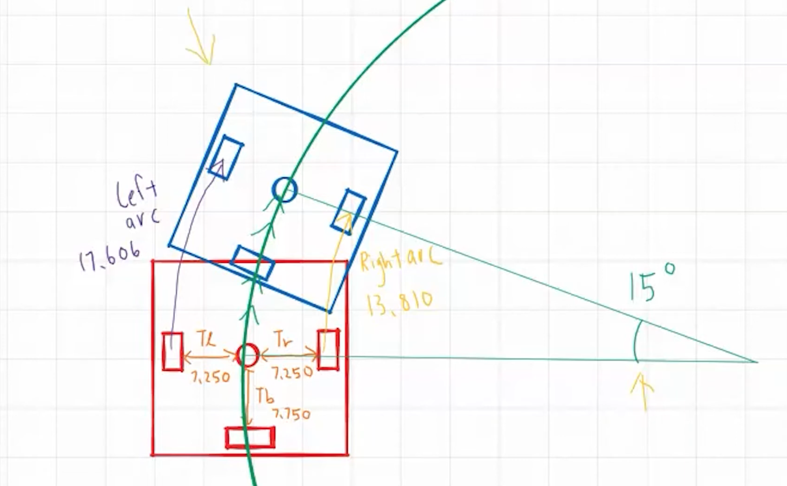
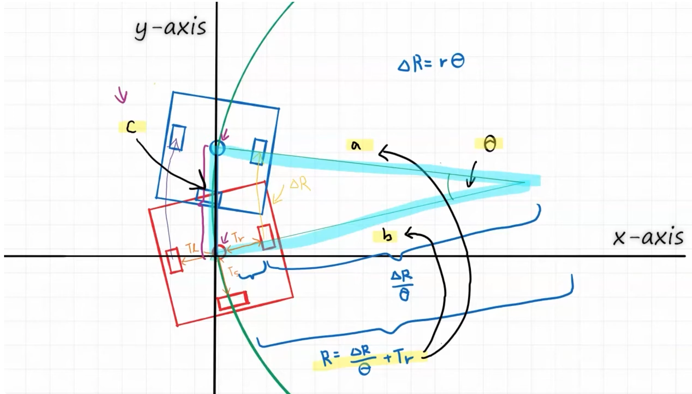
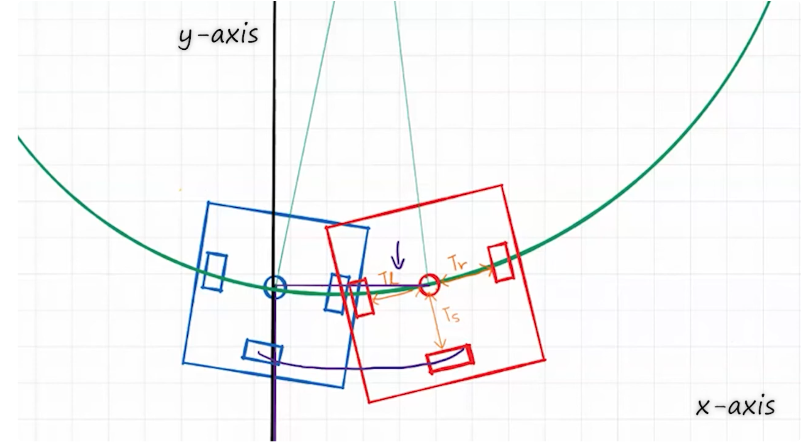

## What is odometry 
Process of using motion sensors like encoders, visual, distance sensor to detect changes in position.  
Using odometry we can keep track of robot's position and orientation during autonomous. We called it **absolute positioning system**   
*Desi language - sensors ko padh kar apne khud ke raste aur location ka hisaab rakhne ki technique ko hi odometry kehte hain.*  
Generally, to track the wheels we mount three non-driven omni wheels (unpowered). Usually we call them **tracking wheels**. On these wheels, encoders are there.  
Due to wheel slippage, we don,t use the main drive wheels encoders or mount on them.  
**Strengths**
1. We can tell robot go to this specific coordinates rather than 5 feet forward and 90 degree rotate.
2. Due to this we can use PID controller. 

**Weakness**
1. To use this algorithm, it needs to calculate continously at small small interval so that position updates also instantneously. Computation might be heavy. 
2. Might be risk of error accumulation.

## Orientation Vector
To make math easy, we have to create an arc. We create an tracking centre, an imaginary point. We are doing all of the calculations from this centre. 
  
Distance from the left wheel and centre = Tl.
For the right = Tr.   
Make sure that left and right wheels should be parallel and perpendicular to the centre.  
When robot rotats then the left wheel, right wheel and tracking centre makes different different arcs. But all of them are concentric, means their &theta; are same.  
When we apply basic formula.  Arc Length = Radius × Angle (s=rθ).  
ΔL means left wheel kitna chlan. ΔR means right wheel kitna chla.  
ΔL = (R + Tl) × θ ; ΔR = (R - Tr) × θ . 
After considering these equations and equate them. We can find the unknown R  
&theta; =  (&Delta;L - &Delta;R) / (Tl + Tr).  
## Position Vector
It means, how much robot orients we only need two things. &Delta;L and &Delta;R. But this gives the results in radians, so we need to multiply by 180/&pi;.  
Now we focus on position vector of the robot. Means to say X,Y co-ordinates.  
To simplify the maths, we set the Y-axis in such a way that the line made of old tracking centre point and new tracking centre aligns on the Y-axis.  
  
As we can see the centre of the robot makes an  isosceles triangle and the third side of this triangle gives us Y movement of the robot.  
By the help of law of cosines, c2 = a2 + b2 - 2abcos(C). In the picture side a and b are the arc of radius (R). And we know that R = (&Delta;R / &theta;) + Tr where &Delta;R is right wheel movement and Tr is the distance (as seen in the diagram.)
By putting the values in the formula, I get.   
$Y = 2 \sin\left(\frac{\theta}{2}\right) \times \left(\frac{\theta}{\Delta R} + T_r\right)$
Now this formula is for Y axis.  
To get the value of X-codinates we need back tracking wheel. Like this  
  
Whole math is like Y-cordinates but instead of right wheel we have to consider the back wheel (&Delta;S) and distance of back wheel from the centre (Ts) and we will get.  
$X = 2 \sin\left(\frac{\theta}{2}\right) \times \left(\frac{\theta}{\Delta S} + T_s\right)$  

Like this at every microsecond we calcualte X and Y distance. To calcualte the last field position of X and Y we sum the X and Y positions, which we collected, and add with the starting positions. 
